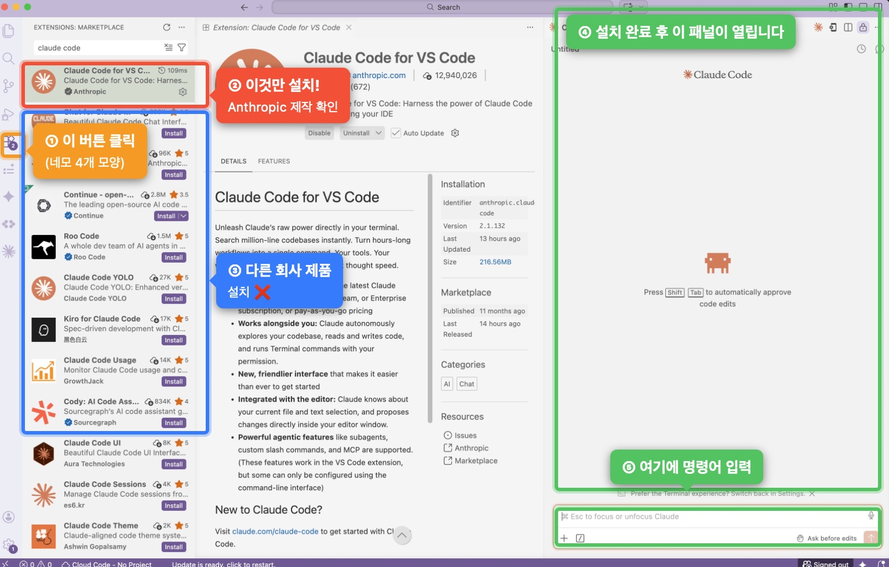

# Mac 시작 가이드

코딩을 한 번도 안 해봤어도 괜찮습니다. 순서대로 따라오세요.

---

## 1단계 — GitHub 계정 만들기

**GitHub**는 코드를 저장하고 인터넷에 공유할 수 있는 서비스입니다. 우리가 만드는 앱은 GitHub에 올려두면 누구나 링크로 접속할 수 있습니다. 네이버 블로그에 글을 올리는 것과 비슷하다고 생각하면 됩니다. 무료로 사용할 수 있어요.

가입할 때 정하는 **사용자명(username)**이 곧 GitHub 아이디이고, 이게 앱 주소의 일부가 됩니다. 나중에 앱 이름(레포 이름)도 직접 정하게 되는데, 이 두 가지가 합쳐져서 앱 주소가 만들어집니다.

예를 들어 사용자명을 `myname`, 앱 이름을 `outcasts2026`으로 정하면 앱 주소는 `https://myname.github.io/outcasts2026/` 이 됩니다. 친구들에게 이 링크를 공유하면 바로 접속할 수 있어요.

이미 계정이 있으면 건너뛰세요.

1. https://github.com 접속
2. **Sign up** 클릭
3. 이메일, 비밀번호, 사용자명 입력 후 가입

---

## 2단계 — 프로그램 설치

### Git 설치

GitHub에 파일을 올리는 데 내부적으로 필요한 도구입니다. 직접 사용할 일은 거의 없지만 설치는 필요합니다.

1. https://git-scm.com/download/mac 접속
2. 다운로드된 파일 실행 후 설치 (옵션은 모두 기본값으로)

### VS Code 설치

**VS Code**는 코드를 편집하는 프로그램입니다. 메모장과 비슷하지만 코드 작업에 특화되어 있어요. 이 가이드에서는 VS Code 안에서 모든 작업을 진행합니다.

1. https://code.visualstudio.com 에서 **Download for Mac** 클릭
2. 다운로드된 파일을 Applications 폴더로 드래그해서 설치
3. VS Code 실행

### Claude Code 확장 설치

**확장(Extension)**은 VS Code에 기능을 추가하는 플러그인입니다. 앱스토어에서 앱을 설치하듯이, VS Code 안에서 Claude Code를 검색해서 설치합니다.

1. VS Code 왼쪽 사이드바에서 네모 4개 모양 아이콘 클릭 (또는 `Cmd+Shift+X`)
2. 검색창에 `Claude Code` 입력
3. **Claude Code for VS Code** (Anthropic 제작) 옆 **Install** 클릭
4. 설치 후 왼쪽 사이드바에 Claude 아이콘이 생깁니다



> 위 사진은 이미 설치된 상태라 Disable/Uninstall 버튼이 보이지만, 처음 설치할 때는 **Install** 버튼이 표시됩니다.

### Claude Code 로그인

> **요금 안내**: Claude Code는 유료 구독이 필요합니다. Pro 플랜(월 $20)이 가장 기본이며, https://claude.ai/settings/billing 에서 확인하세요.

1. 왼쪽 사이드바의 Claude 아이콘 클릭
2. **Sign in** 버튼 클릭
3. Anthropic 계정이 없으면 https://claude.ai 에서 먼저 가입 후 플랜 구독
4. 로그인 완료 후 Claude Code 패널이 열립니다

---

## 3단계 — 이 레포 받아오기

레포(Repository)란 GitHub에 올라가 있는 파일 묶음입니다. 우리가 만들 앱의 기본 틀이 여기 들어있습니다.

Claude Code 패널 입력창에 아래처럼 부탁하세요. Claude가 알아서 받아줍니다.

```
https://github.com/musical-otk/sample.git 이 레포를 바탕화면에 클론해줘
```

---

## 4단계 — 앱 만들기

1. 왼쪽 사이드바의 Claude 아이콘 클릭
2. Claude Code 패널 입력창에 아래 명령을 입력하고 엔터

```
/new-musical
```

> **처음이라 막막하다면**: `/new-musical` 대신 "나 코딩 처음인데 뮤지컬 앱 만들고 싶어" 라고 말해도 됩니다. Claude가 하나씩 안내해줍니다.

Claude가 단계별로 질문합니다. 처음 실행 시 GitHub 사용자명을 물어보는데, 1단계에서 만든 사용자명을 입력하면 됩니다. 이후엔 자동으로 기억합니다.

질문 예시:
```
뮤지컬 한글명이 무엇인가요?
→ 아웃캐스트  (입력 후 엔터)

앱 대표 이모지를 골라주세요.
→ 🗡️

역할 수는 몇 개인가요?
→ 2
```

모든 질문에 답하면 앱 파일 생성과 GitHub 배포까지 자동으로 완료됩니다.

---

## 5단계 — GitHub Pages 활성화

앱 파일은 GitHub에 올라갔지만, 링크로 접속하려면 Pages를 한 번 켜줘야 합니다.

1. https://github.com/{내 사용자명}/{앱 이름} 접속
2. 상단 **Settings** 탭 클릭
3. 왼쪽 메뉴에서 **Pages** 클릭
4. **Source** → **Deploy from a branch** 선택
5. **Branch** → **main** / 폴더 → **/ (root)** 선택 후 **Save**

1~3분 후 `https://{사용자명}.github.io/{앱 이름}/` 에서 앱을 확인할 수 있습니다.

---

## 막혔을 때

어떤 단계든 에러가 나거나 이해가 안 되면 Claude Code 패널에 그대로 붙여넣고 물어보세요.

예: "이런 에러가 났어요: [에러 메시지]"
