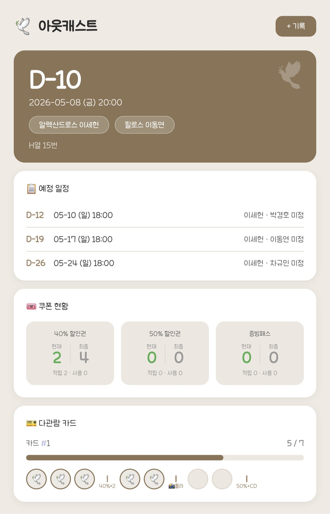
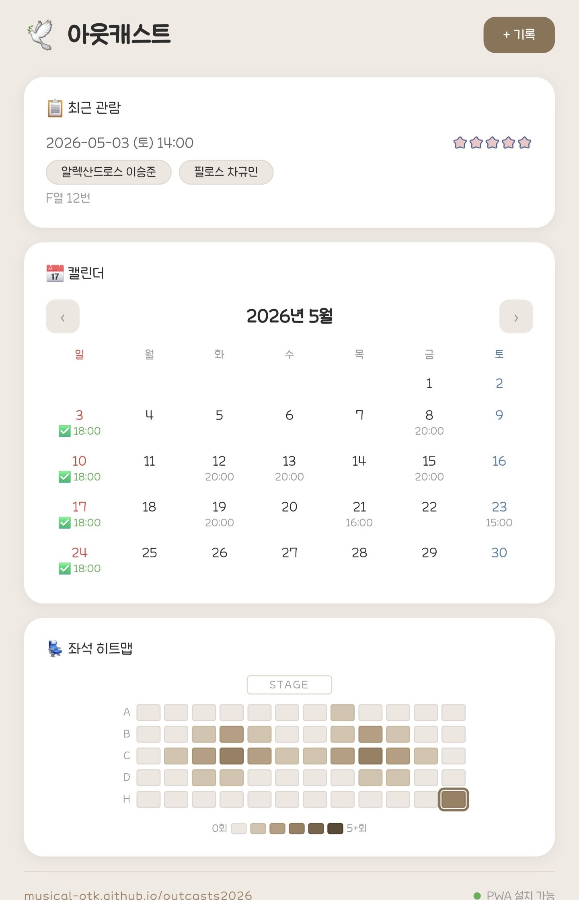

# 🎭 뮤지컬 관극 다이어리 Kit

나만의 뮤지컬 관극 다이어리 앱을 만들 수 있는 템플릿입니다.  
코딩을 전혀 몰라도 괜찮아요. Claude AI가 대신 만들어줍니다. 😊

---

## ✨ 어떻게 동작하나요?

Claude AI에게 뮤지컬 정보를 알려주면, Claude가 직접 앱을 만들고 인터넷에 올리는 것까지 해줍니다.

1. Claude가 뮤지컬 이름, 배우, 색상 등을 질문합니다
2. 답변하면 앱 파일을 자동으로 만들어줍니다
3. GitHub에 올리고 배포까지 완료합니다
4. 완성된 링크를 친구들에게 공유하면 끝! 🎉

> ⚠️ **AI가 실수할 수 있어요!** 완성 후 배우 이름, 날짜, 기능 등이 올바르게 들어갔는지 꼭 확인해주세요. 잘못된 부분은 Claude에게 말하면 바로 수정해줍니다.

---

## 📱 만들어지는 앱

 

👉 [샘플 앱 직접 보기](https://musical-otk.github.io/outcasts2026/)

- D-day 카드, 예정 일정, 쿠폰 현황, 재관람 스탬프 카드
- 공연 일정 캘린더 (배우별 필터)
- 좌석 히트맵, 관람 기록 (캐스팅, 할인권)
- 다크모드 / 홈 화면 추가(PWA)

---

## 🛠 시작 전에 필요한 것

| 항목 | 설명 | 비용 |
|---|---|---|
| GitHub 계정 | 앱을 인터넷에 올리는 서비스 | 무료 |
| VS Code | 코드 편집 프로그램 (Claude가 여기서 작업) | 무료 |
| Claude 구독 | Claude AI 구독 | 무료 / Pro(월 $20) |

> 💡 무료 플랜으로도 시작할 수 있지만, 앱 생성처럼 긴 작업은 중간에 한도에 걸릴 수 있어요. **Pro 플랜(월 $20) 권장**합니다.

---

## 🚀 시작하기

사용하는 컴퓨터에 맞는 가이드를 따라하세요. 설치부터 배포까지 순서대로 설명되어 있습니다.

| 운영체제 | 가이드 |
|---|---|
| 🍎 Mac (맥북, 아이맥) | [GUIDE_MAC.md](GUIDE_MAC.md) |
| 🪟 Windows (윈도우) | [GUIDE_WINDOWS.md](GUIDE_WINDOWS.md) |

---

## 🙋 자주 묻는 것

### 앱 만들기

**Q. 코딩을 전혀 몰라도 할 수 있나요?**

네! Claude가 코드를 직접 작성하고 파일도 만들어줍니다. 뮤지컬 정보를 알려주고 질문에 답하는 것만 하면 돼요.

**Q. VS Code가 뭔가요?**

코드를 편집하는 프로그램이에요. 메모장과 비슷하지만 Claude가 이 안에서 파일을 만들고 수정하는 작업을 합니다. 직접 사용할 일은 거의 없어요.

**Q. Claude가 어디까지 해주나요?**

생각보다 훨씬 많이 해줍니다! 대화하듯 부탁하면 돼요.

- 앱 파일 전체 생성
- GitHub에 올리고 배포
- 오류가 나면 원인을 찾아서 수정
- "배우 추가해줘", "색상 바꿔줘" 같은 수정 요청 처리
- "이런 기능 넣고 싶은데 어떻게 해?" 라고 물어보면 방법을 제안

직접 코드를 볼 필요도, 이해할 필요도 없어요. 원하는 걸 말로 설명하면 됩니다. 😊

**Q. 배우 이름이나 공연 정보를 일일이 타이핑해야 하나요?**

아니요! 캐스팅 공지 캡처, 포스터 사진, 티켓 사진을 그냥 Claude에게 던져주면 알아서 읽고 정리해줍니다. "이 사진 보고 배우 목록 정리해줘" 라고 하면 돼요.

**Q. 앱 만든 후에 내용을 바꾸고 싶어요**

Claude에게 말로 부탁하면 됩니다. "배우 OOO 추가해줘", "스탬프 칸 수 늘려줘" 처럼 요청하면 직접 수정해줘요.

**Q. 기능을 추가하고 싶은데 어떻게 해야 할지 모르겠어요**

Claude에게 "이런 기능을 넣고 싶은데 가능해?" 라고 물어보세요. 가능 여부와 방법을 알려주고, 원하면 직접 만들어줍니다.

### 완성된 앱 사용

**Q. 완성된 앱을 스마트폰에서도 쓸 수 있나요?**

네! 완성된 앱 링크를 스마트폰 브라우저에서 열고 홈 화면에 추가하면 일반 앱처럼 사용할 수 있어요. 앱 만드는 작업은 PC에서 해야 하지만, 완성 후 관람 기록은 스마트폰으로 하면 됩니다.

**Q. 친구에게 공유할 수 있나요?**

완성되면 `https://{사용자명}.github.io/{앱이름}/` 링크가 생겨요. 이 링크를 카카오톡이나 문자로 보내면 누구나 접속할 수 있습니다.

**Q. 데이터가 다른 기기에서 안 보여요**

이 앱은 데이터를 각 기기에 저장합니다. 기기 간 동기화는 지원하지 않아요.

**Q. 앱을 업데이트했는데 폰에서 예전 버전이 보여요**

앱 캐시(임시 저장 데이터) 때문이에요. 앱을 완전히 종료했다가 다시 열면 업데이트된 버전으로 보입니다.

> ⚠️ 홈 화면에서 앱을 삭제하면 캐시와 함께 저장된 데이터도 지워질 수 있어요. 삭제 전에 Claude에게 데이터 백업 방법을 물어보세요.

**Q. 앱 URL에 접속이 안 돼요**

GitHub Pages 배포 후 반영까지 1~3분 걸려요. 잠시 기다렸다가 다시 접속해보세요.

---

## 📄 라이선스

이 템플릿을 이용해 만든 앱은 자유롭게 변형 및 배포할 수 있습니다.

---

## 💬 문의

사용 중 궁금한 점이 있으면 편하게 연락주세요!  
👉 https://x.com/zen__ym
